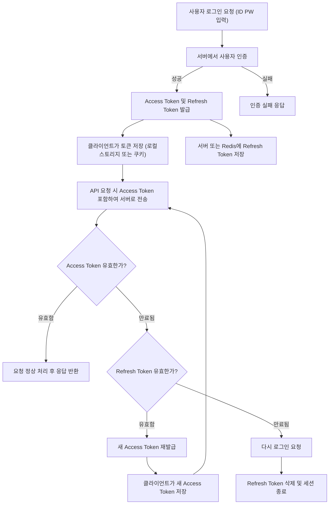

```mermaid
flowchart TD
    %% 로그인 단계
    A["사용자 로그인 요청 (ID PW 입력)"] --> B["서버에서 사용자 인증"]
    B -->|성공| C["Access Token 및 Refresh Token 발급"]
    B -->|실패| Z["인증 실패 응답"]

    %% 토큰 저장 및 요청
    C --> D["클라이언트가 토큰 저장 (로컬스토리지 또는 쿠키)"]
    D --> E["API 요청 시 Access Token 포함하여 서버로 전송"]
    E --> F{"Access Token 유효한가?"}

    %% Access Token 유효
    F -->|유효함| G["요청 정상 처리 후 응답 반환"]

    %% Access Token 만료
    F -->|만료됨| H{"Refresh Token 유효한가?"}

    %% Refresh Token 유효 시
    H -->|유효함| I["새 Access Token 재발급"]
    I --> J["클라이언트가 새 Access Token 저장"]
    J --> E

    %% Refresh Token 만료 시
    H -->|만료됨| K["다시 로그인 요청"]

    %% 로그아웃 혹은 만료 관리
    C --> L["서버 또는 Redis에 Refresh Token 저장"]
    K --> M["Refresh Token 삭제 및 세션 종료"]
```