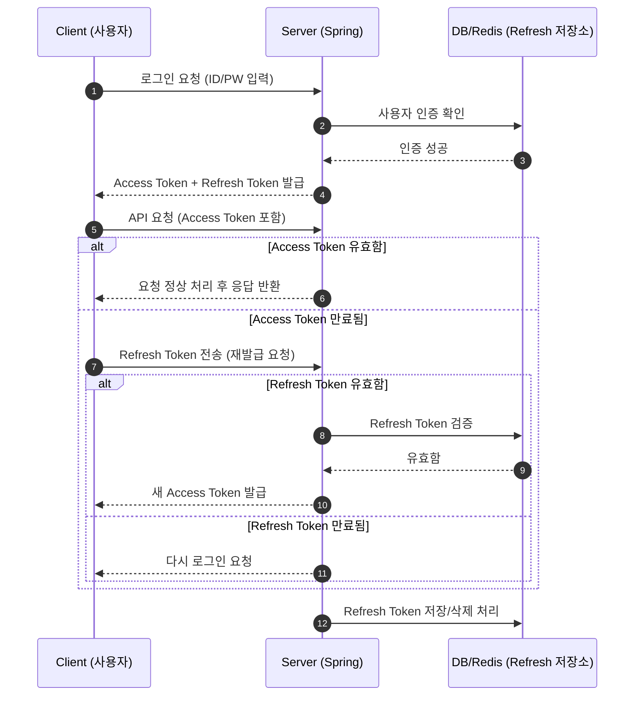

```mermaid

sequenceDiagram
    autonumber
    participant C as Client (사용자)
    participant S as Server (Spring)
    participant DB as DB/Redis (Refresh 저장소)

    %% 로그인
    C->>S: 로그인 요청 (ID/PW 입력)
    S->>DB: 사용자 인증 확인
    DB-->>S: 인증 성공
    S-->>C: Access Token + Refresh Token 발급

    %% 요청
    C->>S: API 요청 (Access Token 포함)
    
    alt Access Token 유효함
        S-->>C: 요청 정상 처리 후 응답 반환
    else Access Token 만료됨
        C->>S: Refresh Token 전송 (재발급 요청)
        alt Refresh Token 유효함
            S->>DB: Refresh Token 검증
            DB-->>S: 유효함
            S-->>C: 새 Access Token 발급
        else Refresh Token 만료됨
            S-->>C: 다시 로그인 요청
        end
    end

    %% 로그아웃 또는 만료 관리
    S->>DB: Refresh Token 저장/삭제 처리
```