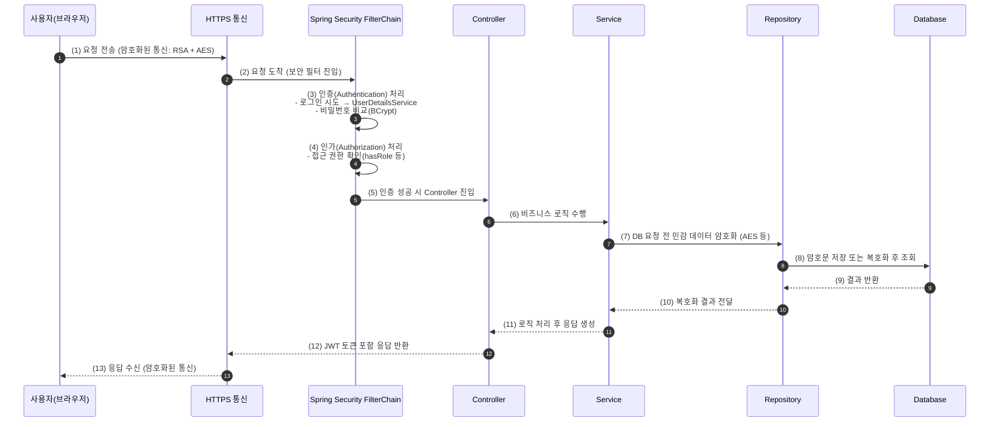

# 데이터베이스 보안
- 어떤 알고리즘을 통해 암호화 할 것인지
- 어떤 데이터를 암호화 할 것인지
- 암호화를 위한 key 관리를 어떻게 할 것인지

# 암호와 알고리즘 종류
1. 대칭키 알고리즘
- 암호화를 위한 Key와 복호화를 위한 Key가 동일한 알고리즘
- e.g. AES 알고리즘

2. 비대칭키 알고리즘
- 암호화를 위한 Key(공개키)와 복호화를 위한 Key(비밀키)가 다른 알고리즘
- e.g. RSA 알고리즘

# 암호와 알고리즘 가치 판단
- 암호화를 적용함에 있어 가장 핵심 가치 판단은 "Key"의 관리
- 암호화 해야하는 비즈니스의 특성에 따라  "Key"의 관리 성격이 달라질 수 있고,
- 이에 따라 선택할 수 있는 적절한 암호화 알고리즘이 변경될 수 있다
  - 데이터베이스 내 데이터를 암호화 하여 저장하기 위한 상황에서 Requirement
    1. 어플리케이션(서버)에서만 암호화, 복호화를 수행
    2. Public 네트워크를 통해 암호화된 데이터를 통신하지 않는다

# 대칭키 알고리즘
- 암호화를 위한 Key와 복호화를 위한 Key가 동일한 알고리즘(e.g. AES 알고리즘)
- 민감한 "Key"가 외부에 노출되었을 때, 피해가 큰 상황에는 사용이 불가능
    - 탈취될 시, 중요한 데이터의 암호화가 전부 의미 없어져 버릴 수 있다.
- 비교적 안전한 곳에서만 사용될 시, 활용 가능.

# 비대칭키 알고리즘
- 암호화를 위한 Key(공개키)와 복호화를 위한 Key(비밀키)가 다른 알고리즘(e.g. RSA 알고리즘)
- 민감한 "Key"가 외부에 노출되었을 때, 피해가 큰 상황에서도 비대칭 특성으로 인해 사용 가능
    - 공개키는 외부에 노출되어도 무방
    - 비밀키가 탈취되었을 시, 중요한 데이터의 암호화가 전부 의미 없어져 버릴 수 있다.


### 참고
** Spring Security
> Spring Security는 암호화를 직접 수행하지 않지만, 그 암호화가 언제, 어떻게, 누구에게 적용될지를 ‘관리·통제’하는 역할을 함.

※ Spring Security의 위치
```css
[클라이언트 브라우저]
     ↓ HTTPS(전송 구간 암호화)
[Spring 서버: Security 필터 체인]
     ↓ 인증(Authentication)
     ↓ 인가(Authorization)
     ↓ JWT 발급/검증
[비즈니스 로직]
     ↓
[DB: AES 등으로 저장 데이터 암호화]
```
| 구분              | Spring Security의 위치      | 하는 일                |
| --------------- | ------------------------ | ------------------- |
| HTTPS           | 서버 앞단 (Tomcat과 함께)       | 네트워크 통신 보안          |
| Spring Security | 애플리케이션 계층 (Filter Chain) | 인증·인가 정책 통제         |
| JWT             | Security 내부 Filter 계층    | 인증 정보 전달 및 검증       |
| DB 암호화          | Repository 전 단계          | 민감정보 보호 (직접 암호화 수행) |

※ 보안계층 흐름도
